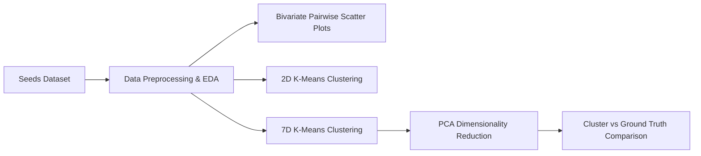

# 🌾 Seeds Dataset - Unsupervised Learning & Clustering Analysis

An end-to-end unsupervised machine learning project exploring clustering algorithms and dimensionality reduction techniques on the **UCI Seeds Dataset**. This study implements **K-Means Clustering** across different feature spaces and utilizes **Principal Component Analysis (PCA)** for 2D subspace projection and cluster verification against ground-truth wheat seed varieties.

---

## 📌 Table of Contents
- [Overview](#-overview)
- [Dataset Description](#-dataset-description)
- [Project Workflow](#-project-workflow)
- [Key Techniques & Results](#-key-techniques--results)
- [Repository Structure](#-repository-structure)
- [Getting Started](#-getting-started)
- [Tech Stack](#-tech-stack)
- [License](#-license)

---

## 🔬 Overview

Unsupervised learning aims to discover underlying structures and natural groupings within unlabeled data. In this repository, we analyze wheat seed varieties based on their geometric and morphological properties without relying on labels during the training phase.

### Objectives:
1. **Exploratory Data Analysis (EDA)**: Understand bivariate distributions and inter-feature correlations.
2. **2D K-Means Clustering**: Benchmark clustering behavior using selected morphological features (`compactness` vs. `asymmetry`).
3. **High-Dimensional K-Means Clustering**: Fit K-Means on the complete 7-dimensional feature space.
4. **Dimensionality Reduction with PCA**: Compress the 7D geometric feature space into 2 principal components for visualization and comparative evaluation against actual seed classes.

---

## 📊 Dataset Description

The dataset used is the **UCI Machine Learning Repository Seeds Dataset**, consisting of measurements of geometrical properties of kernels belonging to three different wheat varieties: **Kama (1)**, **Rosa (2)**, and **Canadian (3)**.

### Features:
| Feature | Description |
| :--- | :--- |
| `area` | Kernel area ($A$) |
| `perimeter` | Kernel perimeter ($P$) |
| `compactness` | Compactness coefficient ($C = 4\pi A / P^2$) |
| `length` | Length of kernel |
| `width` | Width of kernel |
| `asymmetry` | Asymmetry coefficient |
| `groove` | Length of kernel groove |
| `class` | Wheat seed class (1: Kama, 2: Rosa, 3: Canadian) *(used for ground truth validation only)* |

---

## 🛠️ Project Workflow



1. **Data Ingestion**: Loading whitespace-separated dataset into Pandas DataFrames.
2. **Pairwise Visualization**: Automated pairwise feature plotting with Seaborn to inspect class separability.
3. **Clustering ($K=3$)**: Partitioning instances into 3 distinct clusters using Scikit-Learn's `KMeans`.
4. **PCA Projection**: Transforming 7D feature vectors into orthogonal 2D principal component space (`pca1`, `pca2`).
5. **Evaluation**: Visual comparison between unsupervised clusters and ground-truth classes.

---

## 📈 Key Techniques & Results

- **2D Clustering**: Evaluating clustering using only two features (`compactness` vs `asymmetry`) provides a baseline for understanding cluster boundaries.
- **Full-Dimensional Clustering**: Incorporating all 7 morphological features captures complete geometric variances across wheat varieties.
- **PCA Dimensionality Reduction**:
  - Compresses 7 features down to 2 principal components ($X \in \mathbb{R}^{N \times 7} \rightarrow X_{\text{PCA}} \in \mathbb{R}^{N \times 2}$).
  - Allows projection of multi-dimensional cluster labels against true variety labels, demonstrating high alignment between unsupervised K-Means groupings and botanical classifications.

---

## 📁 Repository Structure

```text
├── fcc_seeds_unsupervised.ipynb   # Main Jupyter Notebook with data analysis, K-Means & PCA
├── seeds_dataset.txt              # Raw UCI Seeds dataset file
├── seeds.zip                      # Compressed dataset archive
├── requirements.txt               # Required Python dependencies
├── .gitignore                     # Git ignore rules
└── README.md                      # Project documentation
```

---

## 🚀 Getting Started

### Prerequisites
Make sure you have Python 3.8+ installed on your system.

### 1. Clone the Repository
```bash
git clone https://github.com/ShibilAhamed701212/seeds-clustering-pca-analysis.git
cd seeds-clustering-pca-analysis
```

### 2. Install Dependencies
```bash
pip install -r requirements.txt
```

### 3. Launch Jupyter Notebook
```bash
jupyter notebook fcc_seeds_unsupervised.ipynb
```

---

## 💻 Tech Stack

- **Language**: Python 3
- **Machine Learning**: `scikit-learn` (KMeans, PCA)
- **Data Manipulation**: `pandas`, `numpy`
- **Data Visualization**: `matplotlib`, `seaborn`
- **Environment**: Jupyter Notebook / Google Colab

---

## 📜 Acknowledgments

- **Dataset Source**: [UCI Machine Learning Repository - Seeds Dataset](https://archive.ics.uci.edu/dataset/236/seeds) (M. Charytanowicz, J. Niewczas, P. Kulczycki, P.A. Kowalski, S. Lukasik, S. Zak).
