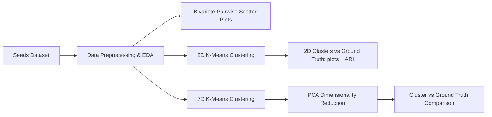
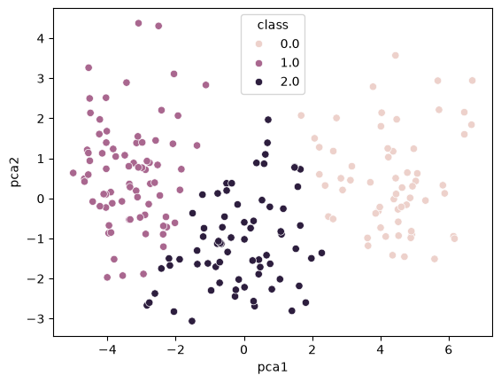
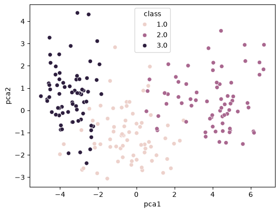

# 🌾 Seeds Dataset - Unsupervised Learning & Clustering Analysis

An end-to-end unsupervised machine learning project exploring clustering algorithms and dimensionality reduction techniques on the **UCI Seeds Dataset**. This study implements **K-Means Clustering** across different feature spaces and utilizes **Principal Component Analysis (PCA)** for 2D subspace projection and cluster verification against ground-truth wheat seed varieties.

---

## 📌 Table of Contents
- [Overview](#-overview)
- [Dataset Description](#-dataset-description)
- [Project Workflow](#-project-workflow)
- [Key Techniques & Results](#-key-techniques--results)
- [Repository Structure](#-repository-structure)
- [Getting Started](#-getting-started)
- [Testing & CI](#-testing--ci)
- [Known Limitations](#️-known-limitations)
- [Tech Stack](#-tech-stack)
- [Acknowledgments](#-acknowledgments)

---

## 🔬 Overview

Unsupervised learning aims to discover underlying structures and natural groupings within unlabeled data. In this repository, we analyze wheat seed varieties based on their geometric and morphological properties without relying on labels during the training phase.

### Objectives:
1. **Exploratory Data Analysis (EDA)**: Understand bivariate distributions and inter-feature correlations.
2. **2D K-Means Clustering**: Benchmark clustering behavior using selected morphological features (`compactness` vs. `asymmetry`).
3. **High-Dimensional K-Means Clustering**: Fit K-Means on the complete 7-dimensional feature space.
4. **Dimensionality Reduction with PCA**: Compress the 7D geometric feature space into 2 principal components for visualization and comparative evaluation against actual seed classes.

---

## 📊 Dataset Description

The dataset used is the **UCI Machine Learning Repository Seeds Dataset**, consisting of measurements of geometrical properties of kernels belonging to three different wheat varieties: **Kama (1)**, **Rosa (2)**, and **Canadian (3)**.

### Features:
| Feature | Description |
| :--- | :--- |
| `area` | Kernel area ($A$) |
| `perimeter` | Kernel perimeter ($P$) |
| `compactness` | Compactness coefficient ($C = 4\pi A / P^2$) |
| `length` | Length of kernel |
| `width` | Width of kernel |
| `asymmetry` | Asymmetry coefficient |
| `groove` | Length of kernel groove |
| `class` | Wheat seed class (1: Kama, 2: Rosa, 3: Canadian) *(used for ground truth validation only)* |

---

## 🛠️ Project Workflow



1. **Data Ingestion**: Loading the whitespace-separated dataset into a Pandas DataFrame (`sep=r"\s+"`, because 11 rows in the UCI file use double tabs).
2. **Pairwise Visualization**: Seaborn scatter plots for all 21 feature pairs, coloured by true class, to inspect separability.
3. **Clustering ($K=3$)**: Partitioning instances into 3 distinct clusters using Scikit-Learn's `KMeans`.
4. **PCA Projection**: Transforming 7D feature vectors into orthogonal 2D principal component space (`pca1`, `pca2`).
5. **Evaluation**: Side-by-side plots of clusters vs. ground-truth classes, plus the Adjusted Rand Index for each clustering.

---

## 📈 Key Techniques & Results

K-Means cluster ids are arbitrary (0, 1, 2) and do not line up with the class labels (1, 2, 3), so the notebook scores each clustering with the **Adjusted Rand Index (ARI)** against the true varieties (1.0 = perfect agreement, 0.0 = chance). Both K-Means fits use `n_init=10, random_state=42`, so these numbers reproduce exactly on every run.

| Clustering | Features | ARI vs. true variety |
| :--- | :--- | :--- |
| K-Means, K=3 | `compactness`, `asymmetry` | 0.152 |
| K-Means, K=3 | all 7 features (unscaled) | 0.717 |

- **2D clustering** on `compactness` vs `asymmetry` gives a weak baseline: those two features alone barely separate the varieties.
- **7D clustering** recovers most of the variety structure.
- **PCA** projects the 7 features to 2 components (`pca1`, `pca2`) so the 7D clusters can be plotted next to the true classes:

| K-Means clusters (7D, shown in PCA space) | True varieties (PCA space) |
| :---: | :---: |
|  |  |

Both images are taken directly from the executed notebook's outputs.

---

## 📁 Repository Structure

```text
├── fcc_seeds_unsupervised.ipynb   # Main Jupyter Notebook with data analysis, K-Means & PCA
├── seeds_dataset.txt              # Raw UCI Seeds dataset file
├── seeds.zip                      # Zip of the same seeds_dataset.txt (byte-identical)
├── docs/images/                   # Figures exported from the executed notebook
├── requirements.txt               # Required Python dependencies
├── ruff.toml                      # Lint configuration (also checks the notebook)
├── .github/workflows/ci.yml       # CI: lint + execute the notebook end to end
├── .gitignore                     # Git ignore rules
└── README.md                      # Project documentation
```

---

## 🚀 Getting Started

### Prerequisites
Python 3.8 or newer. The notebook is executed in CI on Python 3.12 with the latest versions allowed by `requirements.txt`; the minimum versions listed there have not been tested.

### 1. Clone the Repository
```bash
git clone https://github.com/ShibilAhamed701212/seeds-clustering-pca-analysis.git
cd seeds-clustering-pca-analysis
```

### 2. Install Dependencies
```bash
pip install -r requirements.txt
```

### 3. Launch Jupyter Notebook
```bash
jupyter notebook fcc_seeds_unsupervised.ipynb
```

The notebook reads `seeds_dataset.txt` from the working directory, so start Jupyter from the repository root. On Google Colab, upload `seeds_dataset.txt` to the session first.

### 4. Run it headlessly (optional)
```bash
jupyter nbconvert --to notebook --execute fcc_seeds_unsupervised.ipynb --output-dir /tmp
```

---

## ✅ Testing & CI

There is no unit-test suite; the notebook itself is the artifact. GitHub Actions (`.github/workflows/ci.yml`) runs on every push to `main` and every pull request:

```bash
pip install -r requirements.txt ruff
ruff check .                      # lints the notebook cells
jupyter nbconvert --to notebook --execute fcc_seeds_unsupervised.ipynb --output-dir /tmp
```

The build fails if any cell raises an error.

---

## ⚠️ Known Limitations

- **Features are not standardised** before K-Means and PCA. `area` and `perimeter` have far larger ranges than `compactness`, so they dominate the distances and the first principal component. Standardising the features (e.g. `StandardScaler`) raised the 7D ARI to about 0.77 in a separate check; the notebook keeps the original unscaled analysis.
- **K is fixed at 3** from prior knowledge of the three varieties; the notebook does not choose K from the data (elbow or silhouette).
- PCA is fitted on all 7 features for visualisation only; clustering is not re-run in PCA space.

---

## 💻 Tech Stack

- **Language**: Python 3
- **Machine Learning**: `scikit-learn` (KMeans, PCA)
- **Data Manipulation**: `pandas`, `numpy`
- **Data Visualization**: `matplotlib`, `seaborn`
- **Environment**: Jupyter Notebook / Google Colab

---

## 📜 Acknowledgments

- **Dataset Source**: [UCI Machine Learning Repository - Seeds Dataset](https://archive.ics.uci.edu/dataset/236/seeds) (M. Charytanowicz, J. Niewczas, P. Kulczycki, P.A. Kowalski, S. Lukasik, S. Zak).
